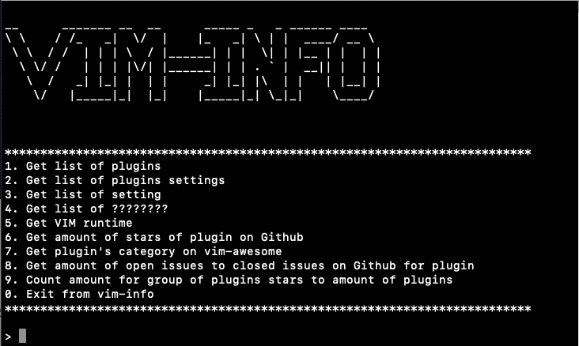
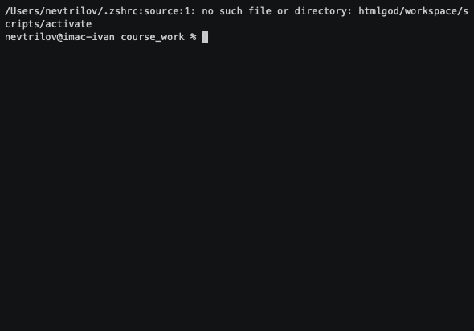
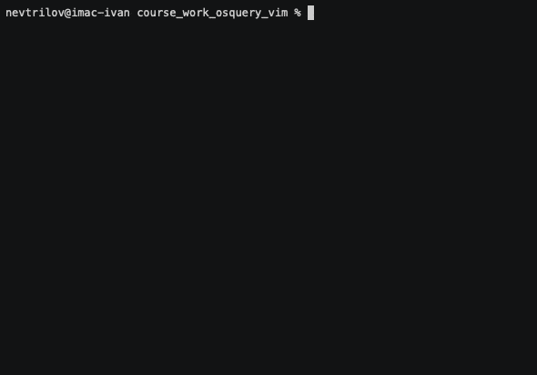

# :floppy_disk: vim-info
`vim-info` - утилита, позволяющая узнать информацию о конфигурации вашего
`VIM/NVIM` редактора.

[](https://travis-ci.com/htmlgod/course_work_osquery_vim)

## Содержание
* [Описание курсового проекта](https://github.com/htmlgod/course_work_osquery_vim#описание-курсового-проекта)
   * [Список задач](https://github.com/htmlgod/course_work_osquery_vim#список-задач)
* [Процесс сборки](https://github.com/htmlgod/course_work_osquery_vim#процесс-сборки)
* [Интеграция с osquery](https://github.com/htmlgod/course_work_osquery_vim#интеграция-с-osquery)
* [Примеры команд](https://github.com/htmlgod/course_work_osquery_vim#примеры-команд)
* [Архитектура проекта](https://github.com/htmlgod/course_work_osquery_vim#архитектура-проекта)
* [Полезные ссылки](https://github.com/htmlgod/course_work_osquery_vim#полезные-ссылки)
* [TODO-лист](https://github.com/htmlgod/course_work_osquery_vim#TODO-лист)

## Описание курсового проекта

Разработать программу/утилиту, предоставляющую информацию о конфигурации текстового редактора `VIM`.
Типы собираемой информации предусмотрены списком задач.

Реализовать возможность установки данной утилиты.
Проект должен иметь процесс сборки, процесс установки и организованную структуру.
После разработки программы интегрировать с `osquery` в виде osquery-расширения (`osquery-extension`).

### Список задач
1. Получить список плагинов
2. Получить список настроек для плагинов
3. Получить список настроек
4. Получить список отображений для режимов
5. Получить время запуска
6. Получить список звезд для плагина на сервисе `GitHub`
7. Классифицировать плагин с помощью `vim-awesome`
8. Получить соотношение открытых `issues` к закрытым для плагина
9. Посчитать соотношение для группы плагинов количество звезд к количеству плагинов в группе

## Процесс сборки
```bash
$ git clone https://github.com/htmlgod/course_work_osquery_vim 
$ cd course_work_osquery_vim
$ git submodule update --init
$ cmake -H. -B_build
$ cmake --build _build
```

## Интеграция с osquery

Необходимо установить все зависимости
```bash
$ export OSQUERY_KEY=1484120AC4E9F8A1A577AEEE97A80C63C9D8B80B
$ sudo apt-key adv --keyserver keyserver.ubuntu.com --recv-keys $OSQUERY_KEY
$ sudo add-apt-repository 'deb [arch=amd64] https://pkg.osquery.io/deb deb main'
$ sudo apt-get update
$ sudo apt-get install osquery
### or
$ brew update
$ brew install osquery
$ /usr/local/bin/osqueryi
$ pip install osquery
```
Запуск расширения (перед запуском необходимо запустить и сделать экспорт данных из `vim-info`)
```bash
$ osqueryi --extension osquery_extension/pluginsExtension.py --allow_unsafe
or
$ python3 osquery_extension/plugins.Extension.py --socket <your_socket>
```
```osquery
Using a virtual database. Need help, type '.help'
osquery> select * from vimplugins;
```

## Примеры команд

1. Получить список плагинов
2. Получить список настроек для плагинов
3. Получить список настроек
4. Получить список отображений для режимов
5. Получить время запуска
6. Получить список звезд для плагина на сервисе `GitHub`


7. Классифицировать плагин с помощью `vim-awesome`
8. Получить соотношение открытых `issues` к закрытым для плагина


9. Посчитать соотношение для группы плагинов количество звезд к количеству плагинов в группе




## Архитектура проекта

[Structure.md](https://gist.github.com/KhmelevskayaYu/37e1c584a141c59493925574316b792d)

## Полезные ссылки

* [Gathered information](https://gist.github.com/htmlgod/e33c7b334f91992d800dd2ce151b3648)
* [GitHub API](https://developer.github.com/v3/)
* [libcurl documentation](https://curl.haxx.se/libcurl/c/libcurl-tutorial.html)
* [nlohmann/json](https://github.com/nlohmann/json)
* [vimdoc](http://vimdoc.sourceforge.net/htmldoc/starting.html)
* [vim wiki](https://vim.fandom.com/wiki/Displaying_the_current_Vim_environment)

## TODO-лист

1. [x] Получить список плагинов
2. [ ] Получить список настроек для плагинов
3. [x] Получить список настроек
4. [ ] Получить список отображений для режимов
5. [x] Получить время запуска
6. [x] Получить список звезд для плагина на сервисе `GitHub`
7. [x] Классифицировать плагин с помощью `vim-awesome`
8. [x] Получить соотношение открытых `issues` к закрытым для плагина
9. [x] Посчитать соотношение для группы плагинов количество звезд к количеству плагинов в группе
10. [x] Интеграция с `osquery`
11. [x] Описать структуру всего проекта
12. [x] Собрать необходимую информацию
13. [x] Написать shell-скрипты
